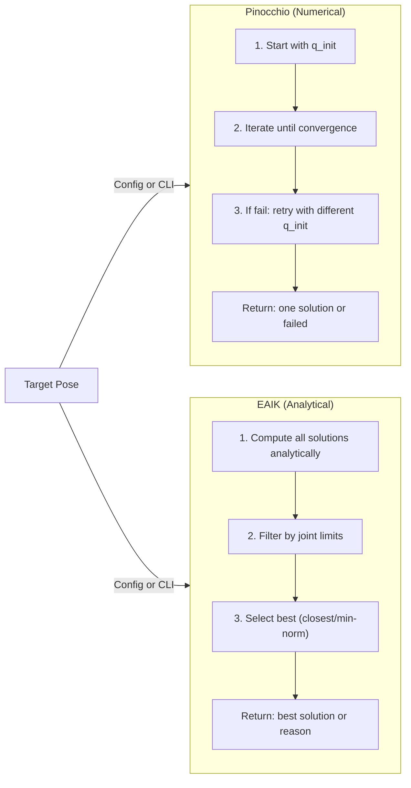

# Feasibility Analysis

Comprehensive guide to the kinematic feasibility analysis tools for validating robot toolpath trajectories using Pinocchio or EAIK solvers.

---

## Overview

The feasibility analysis system evaluates whether robot trajectories are kinematically feasible by checking:

- **Reachability** – Can the robot reach all waypoints? (IK solvability)
- **Manipulability** – Motion capability at each waypoint (Yoshikawa index)
- **Singularity proximity** – Distance from singular configurations
- **C¹ continuity** – Joint velocity limits compliance

**New:** Solver selection via config or CLI – use Pinocchio (numerical) or EAIK (analytical).

---

## Core Components

### 1. `feasibility_analysis.py` – Single Toolpath

Analyzes one toolpath CSV for kinematic feasibility. Loads trajectories in T_P_K (plate frame), transforms to robot base frame, runs IK on each waypoint, computes metrics, and generates reports and plots.

**Key function:** `process_toolpath()` – orchestrates loading, transformation, analysis, and output.

### 2. `feasibility_analysis_batch.py` – Batch Processing

Runs feasibility analysis across multiple robots, knife poses, and toolpaths. Builds a task list and executes via `process_toolpath()` for each combination. Supports parallel execution and solver selection.

**Key function:** `process_batch()` – discovers combinations, dispatches to workers, writes batch summary.

### 3. `core/feasibility_checks.py` – Analysis Logic

Provides the core feasibility logic (solver-agnostic):

- **FeasibilityAnalyzer** – Main analyzer class
  - `analyze_waypoint()` – Single waypoint IK + Jacobian metrics
  - `analyze_trajectory()` – Full trajectory with feasibility flags, safety, smoothness, dexterity
- **FeasibilityResult** – Dataclass with per-waypoint results (reachability, manipulability, condition number, singularity, joint velocity ratio, etc.)
- **compute_manipulability()** – Yoshikawa index: √det(J × J^T), normalized by robot reach
- **compute_singularity_proximity()** – Minimum singular value of Jacobian
- **compute_condition_number()** – κ = σ_max / σ_min
- **check_reachability()** – IK solver (Pinocchio or EAIK) with retries
- **score_ik_solution_breakdown()** – Weighted EAIK multi-solution cost (use `.total` for scalar; C0 + soft singularity penalty − manipulability reward)
- `**_select_best_multi_solution()`** – Scores all `info['all_solutions']` candidates, filters by joint limits, and picks the lowest-cost one

---

## Solver Architecture

### Base Classes (`core/base_solvers.py`)

Abstract interfaces that all solvers implement:

```python
class BaseFKSolver(ABC):
    """Forward kinematics interface"""
    @abstractmethod
    def solve(self, q: np.ndarray) -> FKResult:
        """Returns position, quaternion, rotation matrix"""
    
    @abstractmethod
    def get_jacobian(self, q: np.ndarray) -> np.ndarray:
        """6×n Jacobian (world frame or local frame)"""

class BaseIKSolver(ABC):
    """Inverse kinematics interface"""
    @abstractmethod
    def solve(self, target_pos, target_quat, q_init=None) -> Tuple[bool, np.ndarray, Dict]:
        """Returns (success, joint_config, info_dict)"""
    
    @abstractmethod
    def solve_with_retries(...) -> Tuple[bool, np.ndarray, Dict]:
        """IK with retry strategies (Pinocchio-specific)"""
```

### Pinocchio Solver (`core/pin_ik_solver.py`, `core/pin_fk_solver.py`)

**IK Method:** Damped least-squares (Levenberg–Marquardt style)

- Weighted SE(3) error (rotation + translation)
- Adaptive damping based on Jacobian singular values
- Backtracking line search for stability
- Joint limit clipping

**Initialization Strategies** (configurable):

- `use_initial_guess: true/false` – Try previous joint config
- `use_neutral: true/false` – Try zero configuration (safe default)
- `use_random: true/false` – Try random configurations
- `num_random_retries: N` – Number of random attempts

**Methods:**

- `solve()` – Single target pose with initial guess
- `solve_with_retries()` – Tries strategies sequentially until success
- `get_jacobian()` – 6×n numerical Jacobian

**Config:** `config/ik_config.yaml` – iterations, tolerance, damping, weights, retry strategies.

### EAIK Solver (`core/eaik_ik_solver.py`, `core/eaik_fk_solver.py`)

**IK Method:** Analytical subproblem decomposition

- Returns **all** geometrically valid solutions instantly via `info['all_solutions']`
- No iterative convergence – exact or failed
- Filters solutions by joint limits
- Default selection: closest to previous config or min-norm (configured in `ik_config.yaml`)

**Solution Selection** (configurable in `ik_config.yaml`):

- `solution_selection: "closest"` – Pick solution nearest to q_init
- `solution_selection: "min_norm"` – Pick solution with smallest magnitude

When **multi-solution optimisation** is enabled in `batch_feasibility_config.yaml`, the feasibility analyzer overrides this default pick by scoring all `info['all_solutions']` candidates at each waypoint. See [EAIK Multi-Solution Optimisation](#eaik-multi-solution-optimisation).

**Methods:**

- `solve()` – Single target pose, returns best valid solution + all solutions in `info['all_solutions']`
- `solve_with_retries()` – Deterministic (just calls `solve()` once)
- `get_jacobian()` – Numerical Jacobian via finite differences

**Failure Reasons:**

- `'converged'` – Solution found within joint limits ✓
- `'joint_limits'` – All solutions violate joint limits ✗
- `'no_solutions'` – Target outside workspace ✗

**Config:** `config/ik_config.yaml` – solution selection strategy (EAIK-specific parameters only). Do **not** modify `ik_config.yaml` for multi-solution weights; those belong in `batch_feasibility_config.yaml`.

---

## Solver Comparison




---

## Running the Scripts

### Specifying a Solver

**Via YAML Config:**

All feasibility configs now support the `solver` field:

```yaml
solver: "pin"    # or "eaik"

checks:
  manipulability: true
  singularity: true
  reachability: true
```

**Via CLI Override:**

```bash
python feasibility_analysis.py --toolpath <csv> --knife-pose pose_1 --solver eaik
python feasibility_analysis_batch.py --config config/batch_feasibility_config.yaml --solver pin
```

### Single Toolpath (`feasibility_analysis.py`)

```bash
python feasibility_analysis.py --toolpath path/to/toolpath.csv --knife-pose pose_1

# Full options with solver override
python feasibility_analysis.py \
    --toolpath path/to/toolpath.csv \
    --urdf Assets/Robot\ APCC/urdf/IRB_1300_1400_URDF.urdf \
    --knife-config config/knife_config.yaml \
    --knife-pose pose_1 \
    --output output/feasibility/ \
    --reach 1.4 \
    --singularity-threshold 0.01 \
    --speed 100 \
    --solver eaik \
    --no-continuity   # Skip C1 continuity analysis
```

**CLI Arguments:**


| Argument                  | Default                              | Description                                           |
| ------------------------- | ------------------------------------ | ----------------------------------------------------- |
| `--toolpath`, `-t`        | Required                             | Toolpath CSV file                                     |
| `--urdf`, `-u`            | IRB_1300_1400_URDF_with_fixture.urdf | Robot URDF path                                       |
| `--knife-config`, `-k`    | config/knife_config.yaml             | Knife poses YAML                                      |
| `--knife-pose`            | pose_1                               | Knife pose name                                       |
| `--output`, `-o`          | output/feasibility/                  | Output directory                                      |
| `--reach`, `-r`           | 1.4                                  | Robot reach in meters                                 |
| `--singularity-threshold` | 0.01                                 | Singularity warning threshold                         |
| `--speed`                 | 100                                  | End-effector speed in mm/s                            |
| `--solver`                | pin                                  | Solver: "pin" or "eaik"                               |
| `--base_frame`            | False                                | Toolpath is in robot base frame; skip knife transform |
| `--no-continuity`         | False                                | Skip continuity analysis                              |


### Batch Processing (`feasibility_analysis_batch.py`)

```bash
python feasibility_analysis_batch.py --config config/batch_feasibility_config.yaml

# With parallel workers and solver override
python feasibility_analysis_batch.py \
    --config config/batch_feasibility_config.yaml \
    --workers 4 \
    --solver eaik \
    --output output/my_batch
```

**CLI Arguments:**


| Argument          | Default                              | Description                      |
| ----------------- | ------------------------------------ | -------------------------------- |
| `--config`, `-c`  | config/batch_feasibility_config.yaml | Path to batch config YAML        |
| `--output`, `-o`  | (from config)                        | Override output directory        |
| `--workers`, `-w` | 1                                    | Number of parallel workers       |
| `--solver`        | (from config)                        | Override solver: "pin" or "eaik" |


---

## Output Structure

### Single Toolpath

```
output/feasibility/robot_model_name/toolpath_name/knife_pose_name/
├── trajectory_1/                          (only with --per-trajectory-plots)
│   ├── reachability.png
│   ├── manipulability.png
│   ├── singularity.png
│   ├── continuity_c0.png                  C0 per-waypoint (3 panels)
│   └── continuity_c1.png                  C1 per-waypoint
├── continuity_dashboard_trajectory_1.png  Combined C0+C1+speed dashboard
├── continuity_dashboard_trajectory_2.png
├── decomposed_manipulability_trajectory_1.png   Phase 2: 4-panel decomposed
├── directional_manipulability_trajectory_1.png  Phase 2: w_d along trajectory
├── aggregated_reachability_rate.png
├── aggregated_manipulability.png
├── aggregated_singularity.png
├── aggregated_continuity_c0.png           C0 summary across trajectories
├── aggregated_continuity_c1.png           C1 summary across trajectories
├── aggregated_decomposed_manipulability.png  Phase 2: decomposed per trajectory
├── feasibility_levels_comprehensive.png
├── reachability_summary.png
└── analysis_report.txt
```

### Batch Processing

```
output/feasibility_batch/
├── robot_name__knife_name__toolpath_name/
│   ├── trajectory_1/
│   │   ├── reachability.png
│   │   ├── manipulability.png
│   │   ├── singularity.png
│   │   ├── continuity_c0.png
│   │   └── continuity_c1.png
│   ├── continuity_dashboard_trajectory_*.png
│   ├── aggregated_continuity_c0.png
│   ├── aggregated_continuity_c1.png
│   ├── aggregated_*.png
│   └── analysis_report.txt
└── batch_summary.txt
```

### Report Contents

`analysis_report.txt` includes per-trajectory:

- Reachability (reachable count, unreachable waypoints)
- IK failure details (indices, positions, residuals, singular values)
- Singularity analysis (proximity, warning thresholds)
- Manipulability — unified (mean, min, dexterity index)
- Decomposed manipulability — translational w_v, rotational w_ω, normalized w_norm, directional w_d (mean, min each)
- C0 continuity (pass/fail, max joint-space distance, mean distance)
- C1 continuity (pass/fail, max joint velocities, violations)
- Speed warning (if TCP speed was defaulted to 100 mm/s)

**Example output (EAIK solver):**

```
Trajectory: trajectory_1 — Reachability: 245/250 (98.0%) — Solver: EAIK
  Converged: 245 waypoints
  Joint Limits: 3 waypoints (q7 out of bounds)
  No Solutions: 2 waypoints (target outside workspace)
```

**Example output (Pinocchio solver):**

```
Trajectory: trajectory_1 — Reachability: 245/250 (98.0%) — Solver: Pinocchio
  Initial Guess: 200 waypoints
  Neutral Config: 30 waypoints
  Random Config: 15 waypoints
  Failed: 5 waypoints
```

---

## Configuration Files

### `config/batch_feasibility_config.yaml`

Main config for feasibility and batch runs:

```yaml
solver: "pin"              # "pin" (Pinocchio numerical) or "eaik" (EAIK analytical)

robots_to_use: ["IRB 1300-7/1.4"]
knife_poses_to_use: ["pose_1"]
toolpaths_folder: "Assets/Robot APCC/Toolpaths/Successful"
output_folder: "output/feasibility_batch"
use_base_frame: false      # true = toolpath already in robot base frame, skip knife transform

checks:
  manipulability: true     # Yoshikawa manipulability index
  singularity: true        # minimum singular value proximity check
  reachability: true       # IK solvability
  condition_number: false  # Jacobian condition number (expensive)
  continuity: true         # C0 + C1 continuity analysis

thresholds:
  singularity_warning: 0.01      # σ_min below which to flag singularity
  manipulability_warning: 0.001  # manipulability below which to flag poor dexterity

performance:
  max_ik_failures_per_trajectory: 1  # stop trajectory after N IK failures (0 = no limit)

continuity:
  enabled: true
  pose_scale_m_per_rad: 0.1   # unified pose metric scaling
  safety_factor: 1.05         # 5% margin on velocity limit checks
  default_speed_mm_s: 100.0   # fallback TCP speed when CSV has none

# EAIK multi-solution scoring (only active when solver is "eaik")
eaik_multi_solution:
  enabled: true
  weights:
    c0: 1.0              # joint-space distance penalty
    c1: 2.0              # velocity ratio penalty
    singularity: 1.0     # weight on w_s·log(1+1/σ_min) (soft singularity penalty)
    manipulability: 0.5  # Yoshikawa reward (subtracted from cost)
```

### `config/ik_config.yaml`

IK solver parameters (shared by all feasibility scripts):

```yaml
ik_parameters:
  # Pinocchio-specific
  max_iterations: 50
  tolerance: 1.0e-4
  rot_weight: 0.2
  trans_weight: 1.0
  lambda0: 1.0e-3
  lambda_max: 1.0e1
  max_step: 0.2
  backtrack: true
  
  # Retry strategies (Pinocchio only)
  use_initial_guess: false
  use_neutral: true
  use_random: false
  num_random_retries: 3
  
  # EAIK-specific
  solution_selection: "closest"    # or "min_norm"
  
  # Common
  ee_frame_name: "ee_link"         # or "Link_6" for IRB 1300-7
```

### `config/robots_config.yaml`

Robot definitions (referenced by name in batch configs):

```yaml
robots:
  - name: "IRB 1300-7/1.4"
    urdf_path: "Assets/Robot APCC/urdf/IRB_1300_1400_URDF.urdf"
    reach_m: 1.4
    velocity_limits_rad_s: [...]
    acceleration_limits_rad_s2: [...]

constants:
  joint_jump_limit_rad: 0.5
```

### `config/knife_config.yaml`

Knife poses (T_B_K transforms: translation in mm, quaternion [w,x,y,z]):

```yaml
poses:
  pose_1:
    description: "Default knife pose"
    translation_mm:
      x: -300.0
      y: -900.0
      z: 500.0
    rotation:
      w: 0.005
      x: 0.713
      y: -0.701
      z: 0.001
```

---

## Coordinate Frames

- **T_P_K** – Knife trajectory in plate frame (input CSV)
- **T_B_K** – Knife pose in robot base frame (from `knife_config.yaml`)
- **T_B_P** – Plate pose in base frame (derived)

**Transformation:** `T_B_P = T_B_K @ inv(T_P_K)`

---

## Algorithm Reference

### Yoshikawa Manipulability (Unified — Phase 1)

**Formula:** m = √det(J × J^T), normalized by robot reach

- **Interpretation:** m → 0 near singularity; higher m = more dexterity
- **Scale:** Typically 0–1 for normalized index

### Decomposed & Directional Manipulability (Phase 2)

Phase 1's unified Yoshikawa index mixes translational (m/s) and rotational (rad/s) components, producing a unit-inconsistent quantity. Phase 2 decomposes the analysis into four targeted measures computed at every reachable waypoint.

#### Translational Manipulability (w_v)

```
w_v = √det(Jv × Jv^T)
```

where `Jv` is the translational (linear-velocity) block of the spatial Jacobian (rows 3–5 in the `[angular; linear]` convention). A trajectory demanding continuous positional motion can be rotationally well-conditioned but translationally near-singular, or vice versa.

#### Rotational Manipulability (w_ω)

```
w_ω = √det(Jω × Jω^T)
```

where `Jω` is the rotational (angular-velocity) block (rows 0–2). Relevant when the end-effector must maintain or change orientation (e.g., spiralling knife angle).

#### Normalized Combined Manipulability (w_norm)

```
J_norm = diag(Lc × I₃, I₃) × J
w_norm = √det(J_norm × J_norm^T)
```

`Lc` is the Euclidean distance from the robot base to the end-effector at each configuration, converting angular velocity to a dimensionally equivalent linear velocity. This makes the combined index consistent across translational and rotational components.

#### Directional Manipulability (w_d)

```
w_d = ‖Jv^T × t̂‖₂
```

where `t̂` is the unit tangent of the end-effector translational velocity (computed via finite differences from the waypoint positions). A low `w_d` indicates kinematic stiffness specifically in the direction of motion — the isotropic indices above will not detect this.

#### Configuration

In `config/batch_feasibility_config.yaml`:

```yaml
manipulability:
  enabled: true
  translational_warning: 0.001    # w_v threshold
  rotational_warning: 0.001       # w_ω threshold
  directional_warning: 0.01       # w_d threshold
```

#### Output

Per trajectory:

- `decomposed_manipulability_{trajectory_name}.png` — 4-panel figure (translational, rotational, normalized, directional)
- `directional_manipulability_{trajectory_name}.png` — standalone directional manipulability

Aggregated across trajectories:

- `aggregated_decomposed_manipulability.png` — mean/min bar charts per component

Report section `DECOMPOSED MANIPULABILITY` with mean and min for each component per trajectory.

---

## C0 / C1 Continuity — Full Technical Reference

A trajectory is **continuously feasible** when both C0 and C1 checks pass for every consecutive pair of waypoints. No formulas were changed from the underlying mathematics — what changed is that C0 is now **visualised** and the TCP speed from the CSV is **explicitly tracked and reported**.

### Terminology


| Term                   | Meaning                                                                                                                                                                                                                                                                    |
| ---------------------- | -------------------------------------------------------------------------------------------------------------------------------------------------------------------------------------------------------------------------------------------------------------------------- |
| **Desired TCP speed**  | The commanded end-effector speed stored in the toolpath CSV (column 8, or the `speed` column in header-based CSVs). Unit: mm/s.                                                                                                                                            |
| **Interpolated speed** | The TCP velocity obtained by fitting a cubic spline through the Cartesian waypoint positions and differentiating analytically. This is the speed the robot would actually achieve if it followed the spline path. Shown in plots for comparison against the desired speed. |
| **Velocity ratio**     | `max_j(                                                                                                                                                                                                                                                                    |


### How TCP Speed from the CSV Is Used

1. **Extraction** — `csv_loader_toolpath.py` reads speed per waypoint. For T0-marker CSVs (no header), column index 7 is parsed. For header-based CSVs (e.g. `waypoints_all.csv`), the column named `speed` is used. If neither is found, all waypoints default to 100 mm/s and a warning is emitted.
2. **Time-step computation** — The speed drives the time step between consecutive waypoints:

```
Δt_i = ‖p_i − p_{i−1}‖ / v̄_i

where:
  p_i          = TCP position of waypoint i (metres)
  v̄_i          = (speed_i + speed_{i-1}) / 2   (average speed for the segment, converted to m/s)
```

This replaces any arbitrary fixed time step and ensures the feasibility check answers: "can the robot reach the next waypoint **at the speed the CSV commands**?"

1. **C1 check** — Using the computed Δt, the joint velocity ratio for each segment is:

```
ratio_i = max over joints j of:  |shortest_angular_distance(q_j^{i-1}, q_j^i)| / (Δt_i × limit_j)
```

If `ratio_i > 1.0`, joint `j` would need to move faster than its hardware limit to arrive on time.

1. **Plots** — The continuity dashboard overlays the desired speed (orange markers from CSV) against the interpolated speed (green cubic-spline derivative) so you can visually confirm whether the robot can track the commanded speed profile.

### C0 Continuity (Position-Level)

**Question:** Does the joint configuration change smoothly between consecutive waypoints, or are there sudden jumps (branch switches, IK discontinuities)?

**Metric — Joint-space distance per segment:**

```
d_i = ‖Δq_i‖₂ = √( Σ_j  shortest_angular_distance(q_j^{i-1}, q_j^i)² )
```

- `shortest_angular_distance` wraps the difference to [−π, π] so a joint moving from 359° to 1° correctly reads 2°, not 358°.
- Each joint's individual angular jump is also stored (`per_joint_jumps`) to identify which joint is responsible for a large C0 violation.

**Pass condition:**

```
C0 passes  ⟺  max(d_i)  <  joint_jump_limit_rad
```

The threshold `joint_jump_limit_rad` comes from `robots_config.yaml` (default 0.5 rad ≈ 28.6°).

**What the plots show:**


| Plot                           | Content                                                                                                                                                                     |
| ------------------------------ | --------------------------------------------------------------------------------------------------------------------------------------------------------------------------- |
| **C0 per-waypoint** (3 panels) | Panel 1: bar chart of `d_i` per segment (green/red vs threshold). Panel 2: per-joint angular jumps in degrees (6 lines). Panel 3: Cartesian TCP distance in mm per segment. |
| **C0 summary** (aggregated)    | Max `d_i` per trajectory as a bar chart with threshold line and pass/fail colouring.                                                                                        |


### C1 Continuity (Velocity-Level)

**Question:** Can the robot physically execute the trajectory at the commanded TCP speed without exceeding any joint velocity limit?

**Metric — Joint velocity ratio per segment:**

```
ratio_i = max_j ( |Δq_j^i| / (Δt_i × limit_j) )

where:
  Δq_j^i  = shortest_angular_distance(q_j^{i-1}, q_j^i)     [rad]
  Δt_i    = ‖p_i − p_{i-1}‖ / v̄_i                           [s]
  limit_j = max velocity of joint j                           [rad/s]
```

**Pass condition:**

```
C1 passes  ⟺  max(ratio_i)  ≤  1.0
```

A ratio of 1.5 means the worst joint would need to move at 150% of its limit — the trajectory is not executable at that speed.

**What the plots show:**


| Plot                                      | Content                                                                                                                    |
| ----------------------------------------- | -------------------------------------------------------------------------------------------------------------------------- |
| **C1 per-waypoint** (`continuity_c1.png`) | Cartesian position, velocity magnitude (interpolated vs desired), velocity components, and per-joint velocities vs limits. |
| **C1 summary** (aggregated)               | Max velocity ratio per trajectory with pass/fail.                                                                          |


### Combined C0 + C1 Dashboard

`continuity_dashboard_trajectory_N.png` — a single 4-panel figure per trajectory:


| Panel        | Content                                                                                        |
| ------------ | ---------------------------------------------------------------------------------------------- |
| Top-left     | C0: joint-space distance per segment with threshold line                                       |
| Top-right    | C1: velocity ratio per segment with limit line at 1.0                                          |
| Bottom-left  | TCP speed profile: desired (orange, from CSV) vs interpolated (green, cubic spline derivative) |
| Bottom-right | Overall verdict: **CONTINUOUS** (both pass) or **NOT CONTINUOUS** (either fails)               |


### What Changed (Summary)


| Area                    | Before                                             | After                                                                                       |
| ----------------------- | -------------------------------------------------- | ------------------------------------------------------------------------------------------- |
| **C0 plots**            | C0 computed internally but never plotted           | Full per-waypoint and aggregated C0 graphs                                                  |
| **C0 in report**        | Only pass/fail flag                                | Max jump, mean jump, per-trajectory status in text report                                   |
| **Speed extraction**    | Silently defaulted to 100 mm/s on failure          | `speed_extracted` flag tracked; warning printed and included in report when defaulted       |
| **CSV formats**         | Only T0-marker (index-based columns)               | Also header-based CSVs (column names: `x`, `y`, `z`, `qw`, `qx`, `qy`, `qz`, `speed`)       |
| **Base frame**          | Only knife-frame input (`feasibility_analysis.py`) | `--base_frame` flag skips knife transform; toolpath used as-is                              |
| **Dashboard**           | Separate C1-only plot                              | Combined C0+C1+speed dashboard per trajectory                                               |
| **EAIK multi-solution** | Only "closest" or "min_norm" single pick           | Greedy scoring across all valid solutions for optimal C0/C1/manipulability                  |
| **Formulas**            | No change                                          | No change — same `shortest_angular_distance`, same `dt = dist / speed`, same velocity ratio |


---

## EAIK Multi-Solution Optimisation

### Motivation

The EAIK solver returns **all geometrically valid IK solutions** (up to 8 for a 6-joint robot) in `info['all_solutions']`. The default selection strategy (`closest` or `min_norm` configured in `ik_config.yaml`) picks one solution per waypoint in isolation. This can lead to:

- **C0 jumps** — the solver switches between IK branches, causing large joint-space discontinuities.
- **C1 violations** — the chosen branch forces a joint to exceed its velocity limit at the commanded TCP speed.
- **Poor manipulability** — a nearby branch may offer better dexterity while still satisfying continuity.

Multi-solution optimisation addresses this by evaluating **every** valid candidate at each waypoint against the previous configuration and selecting the one with the lowest weighted cost.

### How It Works

At each waypoint the feasibility analyzer:

1. **Retrieves candidates** — reads `info['all_solutions']` from the EAIK solver (no modifications to `eaik_ik_solver.py`).
2. **Filters for joint limits** — discards any solution that violates the robot's position limits.
3. **Scores each candidate** using the cost function (same as `score_ik_solution_breakdown()` in `core/feasibility_checks.py`):

```
cost(q) = w_c0  × ‖Δq‖₂
         + w_sin × log(1 + 1/max(σ_min, ε))
         − w_man × μ(q)
```

- **σ_min** — smallest singular value of the manipulator Jacobian at `q` (→ 0 near singularities).
- **ε** — small floor (~`1e-9`) so the log argument stays finite.
- **μ** — Yoshikawa manipulability (higher is better; it is **subtracted**, so higher μ lowers cost).
- The **log** singularity term replaces a raw `1/σ_min` penalty so costs stay bounded and comparable to the C0 and manipulability terms near singularities.


| Weight           | Effect when increased                                        | Typical use-case                                                 |
| ---------------- | ------------------------------------------------------------ | ---------------------------------------------------------------- |
| `c0`             | Strongly favours smooth branch transitions; reduces C0 jumps | Trajectories with frequent IK branch switches                    |
| `singularity`    | Stronger push away from small σ_min (still smooth via log)   | Paths near wrist or other singularities                          |
| `manipulability` | Prefers dexterous configurations (higher Yoshikawa index)    | General-purpose — keeps the robot away from kinematic edge cases |


**Tuning guide:**

- Raise `**c0`** if branch switches still cause large joint jumps.
- Raise `**singularity**` if candidates cluster too close to singular poses; lower it if the log term still dominates everything else after retuning.
- Raise `**manipulability**` to prefer dexterity over the other terms.
- C1 / velocity-limit checks are **separate** (continuity phase); they are **not** part of this branch-selection score.

This feature is **ignored** when the solver is `"pin"` (Pinocchio returns a single solution per call).

### Speed Warning

When the CSV contains no extractable speed (neither column 8 nor a `speed` header column), the analysis uses 100 mm/s as a default and prints:

```
WARNING: TCP speed could not be extracted from CSV. Using default speed of 100 mm/s.
C1 velocity analysis may not reflect actual commanded speeds.
```

This warning also appears in `analysis_report.txt`.

---

## Base Frame Mode

When waypoints are already expressed in the robot base frame (no knife transformation needed):

```bash
python feasibility_analysis.py --toolpath waypoints_all.csv --base_frame
```

- Knife config is not loaded; `--knife-pose` is ignored
- `transform_trajectories_to_base_frame()` is skipped
- Output directory omits the knife pose subfolder

In the batch config (`batch_feasibility_config.yaml`):

```yaml
use_base_frame: true   # skip knife poses entirely
```

---

## Advanced Features for Path Continuity

### Feature 1: EAIK All-Solutions Graph with Scores

When the EAIK solver is used, it returns multiple geometrically valid IK solutions per waypoint (~8 candidates). By default, the system picks one (closest to previous, or minimum norm). To visualize and understand the trade-offs between all solutions, enable the EAIK solutions graph.

#### How It Works

1. **Collection**: After trajectory analysis completes, for each waypoint, extract all candidates from `ik_debug_info['all_solutions']`.
2. **Scoring**: Score each candidate using the same cost function as multi-solution selection:
  - `cost = w_c0 × ‖Δq‖ + w_sing × log(1 + 1/max(σ_min, ε)) − w_manip × μ`
  - σ_min is the Jacobian’s smallest singular value; ε is a small floor (~1e‑9). The **log** form avoids unbounded `1/σ_min` spikes near singularities. (C1 velocity terms are not part of this branch score; they appear elsewhere in continuity checks.)
3. **Visualization**: For each joint, create a scatter plot:
  - **X-axis**: Waypoint index (0 to N-1)
  - **Y-axis**: Joint angle (degrees)
  - **Colour-map**: Cost (green = good/low, red = bad/high)
  - **Annotation**: Each dot is labelled with its cost value
  - **Selected solution**: Highlighted with a black square outline
4. **Output**: One PNG per joint (6 total for a 6-DOF robot), saved to `eaik_solutions_scores_j{1..6}.png`

#### Configuration

In `config/batch_feasibility_config.yaml`:

```yaml
output:
  generate_eaik_solutions_graph: true      # enable/disable
  eaik_solutions_max_waypoints: 20         # limit to first N waypoints (to avoid huge plots)
```

#### Use Case

- Understand why the IK solver chose a particular configuration branch
- Identify waypoints where all solutions are poor (near singular, high velocity ratio)
- Validate multi-solution weights — do the colours match your intuition about "good" vs "bad"?

---

### Feature 2: Time Parameterization & Waypoint Density

Robot trajectories are defined as sequences of Cartesian waypoints. The **distance between consecutive waypoints** is critical:

- If waypoints are **too far apart** (e.g., >5–10 mm), the robot path between them is unverified — it may pass through forbidden regions, singularities, or violate joint limits.
- If waypoints are **too sparse** relative to the commanded speed and joint velocity limits, the interpolated trajectory can "cut corners" or violate constraints.

#### How It Works

1. **Arc-length Computation**: For each segment, calculate Cartesian distance between consecutive waypoints:
   \text{arclength}*i = \mathbf{p}*{i+1} - \mathbf{p}_i_2 
2. **Density Check**: For each segment, compute the maximum allowed spacing based on check frequency and commanded speed:
   \text{maxspacing}_i = \frac{\text{speed}_i}{\text{checkfrequency}} 
   Example: at 100 mm/s with 50 Hz check frequency → max 2 mm between waypoints.
3. **Flagging**: Mark segments where `arc_length > max_spacing` as **sparse**.
4. **Optional Densification**: If `interpolate_sparse: true`, interpolate intermediate poses using:
  - Linear interpolation for position
  - SLERP (spherical linear interpolation) for orientation (quaternion)
5. **Reporting**: Add density status and sparse segment indices to the text report and generate a bar chart.

#### Configuration

In `config/batch_feasibility_config.yaml`:

```yaml
time_parameterization:
  enabled: true
  check_frequency_hz: 50.0           # minimum control loop frequency (Hz)
  max_gap_mm: 5.0                    # hard cap on segment arc-length (mm)
  interpolate_sparse: false           # auto-densify before IK if true
  default_speed_mm_s: 100.0           # fallback when CSV has no speed
```

#### Output

- **Text report**: Density status (OK or SPARSE), sparse segment indices, interpolation warning if applicable
- **Plot** (`waypoint_density_{trajectory_name}.png`): Bar chart comparing actual spacing vs. allowed spacing per segment
- **Task-space vs index** (when `task_space_graphs: true`, default): two figures per trajectory in FK-style layout (mm for position, same scaling options as `task_space_adaptive_scale`):
  - `task_space_position_{trajectory_name}.png` — one row, three subplots (X, Y, Z in **mm**) vs waypoint index.
  - `task_space_quaternion_{trajectory_name}.png` — 2×2 subplots (qw, qx, qy, qz) vs waypoint index.
  - If **interpolation** ran (`interpolate_sparse` and sparse segments): every dense sample is shown (line + small markers); **original CSV waypoints** are highlighted with larger orange-edged markers. Without interpolation, a single blue line+markers series is used (input waypoints only).
- **3D splines** (when TOPP-RA graphs are enabled and densification ran):  
  - `3d_spline_original_sparse_{trajectory_name}.png` — Cartesian path from the **original sparse** CSV (pre-interpolation; blue waypoints, no IK reachability colouring).  
  - `3d_spline_interpolated_{trajectory_name}.png` — **densified** path (linear position + SLERP orientation) that IK and TOPP-RA use, with green/red reachability per waypoint.  
  If no densification was applied, a single `3d_spline_{trajectory_name}.png` is produced as before.

#### Use Case

- Verify that sparse toolpath CSVs won't create unvalidated robot paths
- Auto-densify if you trust the toolpath and want to avoid manually interpolating
- Understand the gap between motion-planning waypoint spacing and robot execution sampling rate

---

### Feature 3: TOPP-RA (Time-Optimal Path Parameterization)

**Challenge**: We have a joint-space path (IK solutions) and speed limits. Is the trajectory feasible at the commanded TCP speed?

**Answer**: Use TOPP-RA to compute the **minimum time** required to traverse the path subject to **joint velocity and acceleration limits**. If minimum time > target time, the trajectory is infeasible.

#### How It Works

1. **Path Construction**: Create a cubic spline through all joint configurations:
   \mathbf{q}(s) : s \in [0, 1] \to \mathbb{R}^6 
2. **Constraints Setup**: Define per-joint limits as intervals:
  - Velocity:  -\dot{q}_{\text{limit},j} \leq \dot{q}*j(t) \leq +\dot{q}*{\text{limit},j} 
  - Acceleration:  -\ddot{q}_{\text{limit},j} \leq \ddot{q}*j(t) \leq +\ddot{q}*{\text{limit},j} 
3. **TOPP-RA Algorithm**: Solves the optimal control problem:
   \min T \quad \text{subject to velocity/acceleration constraints and path} 
   Returns the time-optimal parametrization  t(s)  and path velocity profile  \dot{s}(t) .
4. **Feasibility Check**: Compare minimum traversal time vs. target time:
  - If  t_{\min} \leq t_{\text{target}}  → **FEASIBLE** (trajectory can be executed at target speed)
  - If  t_{\min} > t_{\text{target}}  → **INFEASIBLE** (must reduce speed or remove waypoints)
5. **Output**: Report feasibility status, time ratio, and a plot of the time-optimal velocity profile.

#### Configuration

In `config/batch_feasibility_config.yaml`:

```yaml
topp_ra:
  enabled: false                     # opt-in; requires `pip install toppra`
  # Uses velocity_limits_rad_s and acceleration_limits_rad_s2 from robots_config.yaml
```

#### Dependency

```bash
pip install toppra
```

The import is guarded: if `toppra` is not installed and the check is enabled, a warning is printed and the check is skipped gracefully.

#### Output

- **Text report**: Feasibility status, minimum traversal time, target duration, time ratio
- **Plot** (`topp_ra_{trajectory_name}.png`): Time-optimal velocity profile  \dot{s}(t)  showing how the robot must move along the path to respect all constraints
- **Console**: Feasibility status (FEASIBLE/INFEASIBLE) with ratio printed during batch execution

#### Use Case

- **Gold-standard feasibility check**: TOPP-RA is mathematically rigorous and accounts for the full nonlinear joint dynamics
- **Speed validation**: Confirm that your commanded TCP speed is achievable given robot limits
- **Path optimization**: If infeasible, see how much you must slow down (time ratio = min_time / target_time)
- **Debugging**: The velocity profile plot reveals where the robot is velocity-limited vs. free to move faster

---

## References

- [MASTER_README.md](MASTER_README.md) – Repo overview, installation, structure
- [COMBINATORIAL_SEARCH_README.md](COMBINATORIAL_SEARCH_README.md) – Ranking and combinatorial search
- [Pinocchio](https://github.com/stack-of-tasks/pinocchio) – Rigid-body dynamics
- [EAIK](https://github.com/rpiRobotics/eaik) – Analytical IK solver
- Yoshikawa (1985), "Manipulability of Robotic Mechanisms"

