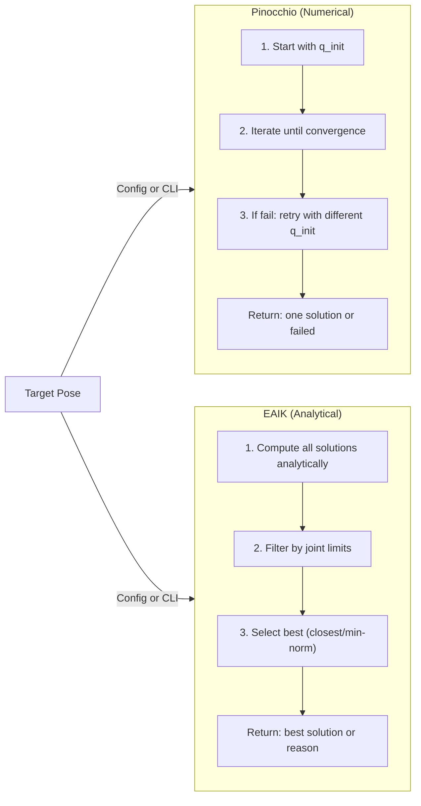

# Feasibility Analysis

Comprehensive guide to the kinematic feasibility analysis tools for validating robot toolpath trajectories using Pinocchio or EAIK solvers.

---

## Overview

The feasibility analysis system evaluates whether robot trajectories are kinematically feasible by checking:

- **Reachability** – Can the robot reach all waypoints? (IK solvability)
- **Manipulability** – Motion capability at each waypoint (Yoshikawa index)
- **Singularity proximity** – Distance from singular configurations
- **C¹ continuity** – Joint velocity limits compliance

**New:** Solver selection via config or CLI – use Pinocchio (numerical) or EAIK (analytical).

---

## Core Components

### 1. `feasibility_analysis.py` – Single Toolpath

Analyzes one toolpath CSV for kinematic feasibility. Loads trajectories in T_P_K (plate frame), transforms to robot base frame, runs IK on each waypoint, computes metrics, and generates reports and plots.

**Key function:** `process_toolpath()` – orchestrates loading, transformation, analysis, and output.

### 2. `feasibility_analysis_batch.py` – Batch Processing

Runs feasibility analysis across multiple robots, knife poses, and toolpaths. Builds a task list and executes via `process_toolpath()` for each combination. Supports parallel execution and solver selection.

**Key function:** `process_batch()` – discovers combinations, dispatches to workers, writes batch summary.

### 3. `core/feasibility_checks.py` – Analysis Logic

Provides the core feasibility logic (solver-agnostic):

- **FeasibilityAnalyzer** – Main analyzer class
  - `analyze_waypoint()` – Single waypoint IK + Jacobian metrics
  - `analyze_trajectory()` – Full trajectory with feasibility flags, safety, smoothness, dexterity
- **FeasibilityResult** – Dataclass with per-waypoint results (reachability, manipulability, condition number, singularity, joint velocity ratio, etc.)
- **compute_manipulability()** – Yoshikawa index: √det(J × J^T), normalized by robot reach
- **compute_singularity_proximity()** – Minimum singular value of Jacobian
- **compute_condition_number()** – κ = σ_max / σ_min
- **check_reachability()** – IK solver (Pinocchio or EAIK) with retries

---

## Solver Architecture

### Base Classes (`core/base_solvers.py`)

Abstract interfaces that all solvers implement:

```python
class BaseFKSolver(ABC):
    """Forward kinematics interface"""
    @abstractmethod
    def solve(self, q: np.ndarray) -> FKResult:
        """Returns position, quaternion, rotation matrix"""
    
    @abstractmethod
    def get_jacobian(self, q: np.ndarray) -> np.ndarray:
        """6×n Jacobian (world frame or local frame)"""

class BaseIKSolver(ABC):
    """Inverse kinematics interface"""
    @abstractmethod
    def solve(self, target_pos, target_quat, q_init=None) -> Tuple[bool, np.ndarray, Dict]:
        """Returns (success, joint_config, info_dict)"""
    
    @abstractmethod
    def solve_with_retries(...) -> Tuple[bool, np.ndarray, Dict]:
        """IK with retry strategies (Pinocchio-specific)"""
```

### Pinocchio Solver (`core/pin_ik_solver.py`, `core/pin_fk_solver.py`)

**IK Method:** Damped least-squares (Levenberg–Marquardt style)

- Weighted SE(3) error (rotation + translation)
- Adaptive damping based on Jacobian singular values
- Backtracking line search for stability
- Joint limit clipping

**Initialization Strategies** (configurable):

- `use_initial_guess: true/false` – Try previous joint config
- `use_neutral: true/false` – Try zero configuration (safe default)
- `use_random: true/false` – Try random configurations
- `num_random_retries: N` – Number of random attempts

**Methods:**

- `solve()` – Single target pose with initial guess
- `solve_with_retries()` – Tries strategies sequentially until success
- `get_jacobian()` – 6×n numerical Jacobian

**Config:** `config/ik_config.yaml` – iterations, tolerance, damping, weights, retry strategies.

### EAIK Solver (`core/eaik_ik_solver.py`, `core/eaik_fk_solver.py`)

**IK Method:** Analytical subproblem decomposition

- Returns all valid solutions instantly
- No iterative convergence – exact or failed
- Filters solutions by joint limits
- Selects best: closest to previous config or min-norm

**Solution Selection** (configurable):

- `solution_selection: "closest"` – Pick solution nearest to q_init
- `solution_selection: "min_norm"` – Pick solution with smallest magnitude

**Methods:**

- `solve()` – Single target pose, returns best valid solution or failure reason
- `solve_with_retries()` – Deterministic (just calls `solve()` once)
- `get_jacobian()` – Numerical Jacobian via finite differences

**Failure Reasons:**

- `'converged'` – Solution found within joint limits ✓
- `'joint_limits'` – All solutions violate joint limits ✗
- `'no_solutions'` – Target outside workspace ✗

**Config:** `config/ik_config.yaml` – solution selection strategy (EAIK-specific parameters only).

---

## Solver Comparison



---

## Running the Scripts

### Specifying a Solver

**Via YAML Config:**

All feasibility configs now support the `solver` field:

```yaml
solver: "pin"    # or "eaik"

checks:
  manipulability: true
  singularity: true
  reachability: true
```

**Via CLI Override:**

```bash
python feasibility_analysis.py --toolpath <csv> --knife-pose pose_1 --solver eaik
python feasibility_analysis_batch.py --config config/batch_feasibility_config.yaml --solver pin
```

### Single Toolpath (`feasibility_analysis.py`)

```bash
python feasibility_analysis.py --toolpath path/to/toolpath.csv --knife-pose pose_1

# Full options with solver override
python feasibility_analysis.py \
    --toolpath path/to/toolpath.csv \
    --urdf Assets/Robot\ APCC/urdf/IRB_1300_1400_URDF.urdf \
    --knife-config config/knife_config.yaml \
    --knife-pose pose_1 \
    --output output/feasibility/ \
    --reach 1.4 \
    --singularity-threshold 0.01 \
    --speed 100 \
    --solver eaik \
    --no-continuity   # Skip C1 continuity analysis
```

**CLI Arguments:**

| Argument | Default | Description |
|----------|---------|-------------|
| `--toolpath`, `-t` | Required | Toolpath CSV file |
| `--urdf`, `-u` | IRB_1300_1400_URDF_with_fixture.urdf | Robot URDF path |
| `--knife-config`, `-k` | config/knife_config.yaml | Knife poses YAML |
| `--knife-pose` | pose_1 | Knife pose name |
| `--output`, `-o` | output/feasibility/ | Output directory |
| `--reach`, `-r` | 1.4 | Robot reach in meters |
| `--singularity-threshold` | 0.01 | Singularity warning threshold |
| `--speed` | 100 | End-effector speed in mm/s |
| `--solver` | pin | Solver: "pin" or "eaik" |
| `--no-continuity` | False | Skip continuity analysis |

### Batch Processing (`feasibility_analysis_batch.py`)

```bash
python feasibility_analysis_batch.py --config config/batch_feasibility_config.yaml

# With parallel workers and solver override
python feasibility_analysis_batch.py \
    --config config/batch_feasibility_config.yaml \
    --workers 4 \
    --solver eaik \
    --output output/my_batch
```

**CLI Arguments:**

| Argument | Default | Description |
|----------|---------|-------------|
| `--config`, `-c` | config/batch_feasibility_config.yaml | Path to batch config YAML |
| `--output`, `-o` | (from config) | Override output directory |
| `--workers`, `-w` | 1 | Number of parallel workers |
| `--solver` | (from config) | Override solver: "pin" or "eaik" |

---

## Output Structure

### Single Toolpath

```
output/feasibility/robot_model_name/toolpath_name/knife_pose_name/
├── trajectory_1/
│   ├── reachability.png
│   ├── manipulability.png
│   ├── singularity.png
│   └── continuity.png
├── trajectory_2/
│   └── ...
├── aggregated_reachability_rate.png
├── aggregated_manipulability.png
├── aggregated_singularity.png
├── aggregated_continuity.png
├── feasibility_levels_comprehensive.png
├── reachability_summary.png
└── analysis_report.txt
```

### Batch Processing

```
output/feasibility_batch/
├── robot_name__knife_name__toolpath_name/
│   ├── trajectory_1/
│   │   ├── reachability.png
│   │   ├── manipulability.png
│   │   ├── singularity.png
│   │   └── continuity.png
│   ├── ...
│   ├── aggregated_*.png
│   └── analysis_report.txt
└── batch_summary.txt
```

### Report Contents

`analysis_report.txt` includes per-trajectory:

- Reachability (reachable count, unreachable waypoints)
- IK failure details (indices, positions, residuals, singular values)
- Singularity analysis (proximity, warning thresholds)
- Manipulability (mean, min, dexterity index)
- Continuity (pass/fail, max joint velocities, violations)

**Example output (EAIK solver):**

```
Trajectory: trajectory_1 — Reachability: 245/250 (98.0%) — Solver: EAIK
  Converged: 245 waypoints
  Joint Limits: 3 waypoints (q7 out of bounds)
  No Solutions: 2 waypoints (target outside workspace)
```

**Example output (Pinocchio solver):**

```
Trajectory: trajectory_1 — Reachability: 245/250 (98.0%) — Solver: Pinocchio
  Initial Guess: 200 waypoints
  Neutral Config: 30 waypoints
  Random Config: 15 waypoints
  Failed: 5 waypoints
```

---

## Configuration Files

### `config/batch_feasibility_config.yaml`

Main config for feasibility and batch runs:

```yaml
solver: "pin"              # or "eaik"

robots_to_use: ["IRB 1300-7/1.4"]
knife_poses_to_use: ["pose_1"]
toolpaths_folder: "Assets/Robot APCC/Toolpaths/Successful"
output_folder: "output/feasibility_batch"

checks:
  manipulability: true
  singularity: true
  reachability: true
  condition_number: false
  continuity: true

thresholds:
  singularity_warning: 0.01
  manipulability_warning: 0.001

performance:
  max_ik_failures_per_trajectory: 1

continuity:
  enabled: true
  pose_scale_m_per_rad: 0.1
  safety_factor: 1.05
  default_speed_mm_s: 100.0
```

### `config/ik_config.yaml`

IK solver parameters (shared by all feasibility scripts):

```yaml
ik_parameters:
  # Pinocchio-specific
  max_iterations: 50
  tolerance: 1.0e-4
  rot_weight: 0.2
  trans_weight: 1.0
  lambda0: 1.0e-3
  lambda_max: 1.0e1
  max_step: 0.2
  backtrack: true
  
  # Retry strategies (Pinocchio only)
  use_initial_guess: false
  use_neutral: true
  use_random: false
  num_random_retries: 3
  
  # EAIK-specific
  solution_selection: "closest"    # or "min_norm"
  
  # Common
  ee_frame_name: "ee_link"         # or "Link_6" for IRB 1300-7
```

### `config/robots_config.yaml`

Robot definitions (referenced by name in batch configs):

```yaml
robots:
  - name: "IRB 1300-7/1.4"
    urdf_path: "Assets/Robot APCC/urdf/IRB_1300_1400_URDF.urdf"
    reach_m: 1.4
    velocity_limits_rad_s: [...]
    acceleration_limits_rad_s2: [...]

constants:
  joint_jump_limit_rad: 0.5
```

### `config/knife_config.yaml`

Knife poses (T_B_K transforms: translation in mm, quaternion [w,x,y,z]):

```yaml
poses:
  pose_1:
    description: "Default knife pose"
    translation_mm:
      x: -300.0
      y: -900.0
      z: 500.0
    rotation:
      w: 0.005
      x: 0.713
      y: -0.701
      z: 0.001
```

---

## Coordinate Frames

- **T_P_K** – Knife trajectory in plate frame (input CSV)
- **T_B_K** – Knife pose in robot base frame (from `knife_config.yaml`)
- **T_B_P** – Plate pose in base frame (derived)

**Transformation:** `T_B_P = T_B_K @ inv(T_P_K)`

---

## Algorithm Reference

### Yoshikawa Manipulability

**Formula:** m = √det(J × J^T), normalized by robot reach

- **Interpretation:** m → 0 near singularity; higher m = more dexterity
- **Scale:** Typically 0–1 for normalized index

### C¹ Continuity

**Metric:** Unified pose distance d = √(d_linear² + (scale × d_angle)²)

- **Timing:** From speed (CSV) and joint velocity limits
- **Check:** max(|Δq_j|/dt) / velocity_limit_j ≤ 1.0

---

## References

- [MASTER_README.md](MASTER_README.md) – Repo overview, installation, structure
- [COMBINATORIAL_SEARCH_README.md](COMBINATORIAL_SEARCH_README.md) – Ranking and combinatorial search
- [Pinocchio](https://github.com/stack-of-tasks/pinocchio) – Rigid-body dynamics
- [EAIK](https://github.com/rpiRobotics/eaik) – Analytical IK solver
- Yoshikawa (1985), "Manipulability of Robotic Mechanisms"
