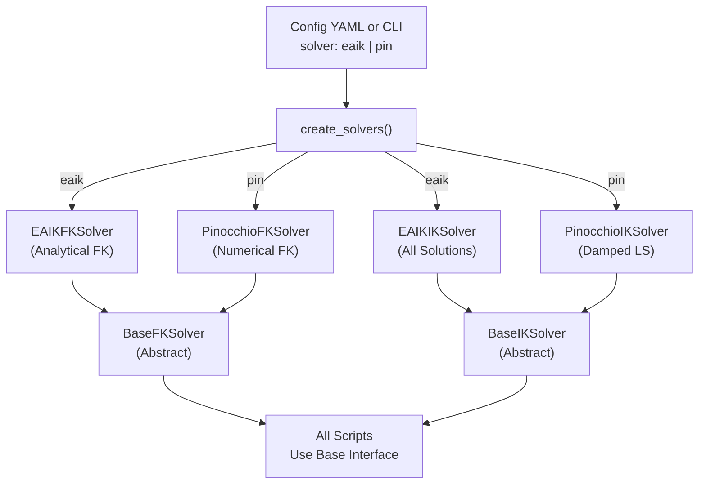
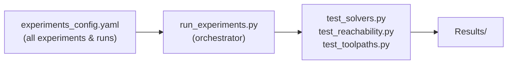

# Robotics-APCC

> Kinematic Analysis & Validation Toolkit for ABB IRB 1300 Robots

A toolkit for validating robot kinematics using Pinocchio or EAIK analytical solvers against ABB RobotStudio, with reachability testing, feasibility analysis, and combinatorial search for optimal knife placement.

**New:** Multi-solver support (Pinocchio numerical IK and EAIK analytical IK) with config-driven selection and CLI overrides.

---

## Table of Contents

- [Installation](#installation)
- [Solvers & Architecture](#solvers--architecture)
- [Repository Structure](#repository-structure)
- [Testing Scripts](#testing-scripts)
- [Automated Experiments](#automated-experiments)
- [Documentation Guide](#documentation-guide)
- [Data Flow](#data-flow)
- [Coordinate Frames](#coordinate-frames)
- [Reconfiguring End-Effector Fixture Pose](#reconfiguring-end-effector-fixture-pose)
- [Toolpath Input Validation](#toolpath-input-validation)
- [Quick Reference](#quick-reference)

---

## Installation

### 1. Install Miniconda/Anaconda

If you don't have conda installed:

- [Miniconda](https://docs.conda.io/en/latest/miniconda.html) (recommended, lightweight)
- [Anaconda](https://www.anaconda.com/download/)

### 2. Create and Activate Environment

```bash
conda create -n robotics python=3.12 -y
conda activate robotics
```

### 3. Install Dependencies

```bash
pip install -r requirements.txt
```

**Required packages:** numpy, pandas, matplotlib, pyyaml, scipy, tqdm, pinocchio, eaik, urchin

---

## Solvers & Architecture

### Dual-Solver Architecture

This toolkit now supports two independent kinematic solvers, selectable via configuration:



### Solver Selection

**Via YAML Config:**
```yaml
solver: "pin"    # or "eaik"
```

**Via CLI Override:**
```bash
python tests/test_solvers.py --solver eaik --ee-frame Link_6 ...
```

### Pinocchio (Numerical)

- **Method:** Damped least-squares (Levenberg–Marquardt)
- **Convergence:** Iterative until tolerance
- **Retries:** Tries multiple initialization strategies (initial guess, neutral, random)
- **Output:** Single solution per target pose
- **Config:** `config/ik_config.yaml` – iterations, tolerance, damping, weights, retry strategies

### EAIK (Analytical)

- **Method:** Analytical subproblem decomposition
- **Solutions:** Returns all valid solutions instantly
- **Filtering:** Filters by joint limits, selects best (closest to previous or min-norm)
- **Output:** Best of all analytical solutions or failure reason
- **Config:** `config/ik_config.yaml` – solution selection strategy

**Failure Modes (EAIK-specific):**
- `converged` – Solution found within joint limits
- `joint_limits` – All solutions violate joint limits
- `no_solutions` – Target outside workspace

---

## Repository Structure

```
Robotics-APCC/
├── core/                           # Core kinematic solvers & analysis
│   ├── base_solvers.py            # Abstract FK/IK solver interfaces
│   ├── pin_ik_solver.py           # Pinocchio IK (damped least-squares)
│   ├── pin_fk_solver.py           # Pinocchio FK + Jacobian
│   ├── eaik_ik_solver.py          # EAIK IK (analytical, all solutions)
│   ├── eaik_fk_solver.py          # EAIK FK + numerical Jacobian
│   ├── feasibility_checks.py      # Manipulability, singularity, reachability
│   └── __init__.py                # Factory: create_solvers(solver="eaik"|"pin")
│
├── utils/                          # Utility modules
│   ├── urdf_loader.py             # Dual-backend URDF loader (Pinocchio / EAIK)
│   ├── config_loader.py           # YAML config + solver-aware IK config loading
│   ├── transform_handler.py       # T_P_K → T_B_P frame transforms
│   ├── csv_loader_toolpath.py     # Toolpath CSV loader
│   ├── csv_loader_robostudio.py   # RobotStudio test data loader
│   ├── feasibility_plot.py        # Feasibility & continuity plots
│   ├── generate_plot_ik.py        # IK comparison & solver outcome plots
│   └── validate_toolpath_input.py # Incoming toolpath Level-1 validation
│
├── config/                         # Main configuration files
│   ├── robots_config.yaml         # Robot definitions (URDF, fixture_name, limits)
│   ├── fixture_config.yaml        # End-effector fixture poses (relative to Link_6)
│   ├── knife_config.yaml          # Knife poses (T_B_K transforms)
│   ├── ik_config.yaml             # IK solver parameters (all solvers)
│   ├── toolpath_validation_config.yaml  # Input validation (knife, URDF, checks)
│   ├── batch_feasibility_config.yaml
│   ├── combinatorial_search_config.yaml
│   └── scoring_weights.yaml
│
├── tests/                          # Testing & validation scripts
│   ├── test_solvers.py            # Compare FK/IK against RobotStudio (any solver)
│   ├── test_reachability.py       # Reachability analysis per waypoint
│   ├── test_toolpaths.py          # Toolpath FK/IK validation
│   ├── run_experiments.py         # Automated experiment orchestrator
│   ├── configs/                   # Test-specific configs
│   │   ├── experiments_config.yaml   # Experiment definitions (robots, runs, solvers)
│   │   ├── test_solvers_config.yaml
│   │   ├── test_reachability_config.yaml
│   │   └── tolerance_config.yaml
│   └── tolerance_check.py         # Helper for test_solvers.py
│
├── feasibility_analysis.py        # Single toolpath feasibility (supports both solvers)
├── feasibility_analysis_batch.py  # Batch feasibility processing
├── combinatorial_search.py        # Combinatorial search & ranking
│
├── Assets/Robot APCC/             # Robot & toolpath assets
│   ├── IRB-1300-*/urdf/          # URDF files
│   ├── Experiments/               # Experiment data directories
│   └── Toolpaths/                # Toolpath CSVs
│
├── MASTER_README.md               # This file – overview, installation, structure
├── FEASIBILITY_ANALYSIS_README.md # Feasibility scripts, IK/FK solvers, configs
└── COMBINATORIAL_SEARCH_README.md # Combinatorial search & ranking
```

---

## Testing Scripts

The toolkit includes three core testing scripts for validating kinematics against RobotStudio reference data.

### 1. **test_solvers.py** – FK/IK Comparison vs RobotStudio

Validates both forward and inverse kinematics against recorded RobotStudio trajectories.

**Purpose:**
- Compare solver FK output against RobotStudio tool center point (TCP) positions
- Compare solver IK output against recorded joint angles
- Measure accuracy and identify systematic errors
- Generate per-waypoint plots and comprehensive analysis

**Features:**
- Supports both Pinocchio and EAIK solvers
- Solver-specific outcome visualization:
  - **Pinocchio:** Shows which initialization method solved each waypoint (initial guess, neutral, random)
  - **EAIK:** Shows failure reason for each unsolvable waypoint (no solutions, joint limits)
- Generates FK/IK comparison plots, error statistics, and CSV exports

**Usage:**
```bash
# Via config file
python tests/test_solvers.py --config tests/configs/test_solvers_config.yaml

# CLI with overrides (solver, EE frame, I/O paths)
python tests/test_solvers.py \
    --urdf Assets/Robot\ APCC/urdf/IRB_1300_1400_URDF.urdf \
    --input Robot_APCC/Experiments/Experiment_7/trajectories \
    --output Robot_APCC/Results/Experiment_7/EAIK \
    --solver eaik \
    --ee-frame Link_6
```

**Config:** `tests/configs/test_solvers_config.yaml`

**Output:**
```
output_folder/
├── global_analysis.txt          # Summary report (solver, ee-frame, statistics)
├── raw_comparison.csv           # Waypoint-by-waypoint FK/IK data
├── fk_position_comparison.png
├── fk_position_deltas.png
├── ik_joint_comparison.png
├── ik_joint_deltas.png
├── ik_success_failure.png       # Green=converged, Red=failed
├── ik_solve_methods.png         # Pinocchio only: initialization methods
└── ik_solve_outcome.png         # EAIK only: failure reasons
```

---

### 2. **test_reachability.py** – Waypoint Reachability Analysis

Tests which waypoints in a toolpath trajectory are kinematically reachable for each robot/knife combination.

**Purpose:**
- Verify reachability of all points along a toolpath
- Identify unreachable regions
- Analyze which initialization/solution strategy worked
- Generate reachability heatmaps and outcome analysis

**Features:**
- Multi-robot, multi-knife-pose testing
- Solver-specific outcome plots (same as `test_solvers.py`)
- Per-trajectory reachability rate
- Identifies unreachable waypoint indices

**Usage:**
```bash
# Via config file
python tests/test_reachability.py --config tests/configs/test_reachability_config.yaml

# CLI with overrides
python tests/test_reachability.py \
    --robot "IRB 1300-7/1.4" \
    --knife-pose Zund \
    --toolpaths-folder Robot_APCC/Experiments/Experiment_12/Toolpaths \
    --output Robot_APCC/Results/Experiment_12/EAIK \
    --solver eaik
```

**Config:** `tests/configs/test_reachability_config.yaml`

**Output:**
```
output_folder/robot_model/knife_name/toolpath_name/
├── reachability_per_waypoint_T1.png
├── ik_success_failure_T1.png
├── ik_solve_methods_T1.png         # Pinocchio only
├── ik_solve_outcome_T1.png         # EAIK only
├── reachability_rate_per_trajectory.png
└── reachability_analysis.txt       # Detailed report
```

---

### 3. **test_toolpaths.py** – Toolpath FK/IK Validation

Validates FK/IK accuracy along complete toolpath trajectories (T_P_K → T_B_P transform).

**Purpose:**
- End-to-end toolpath validation
- Check FK matches RobotStudio TCP positions
- Verify IK matches RobotStudio joint angles
- Detect trajectory discontinuities or solver failures

**Features:**
- Multi-robot, multi-knife-pose, multi-toolpath batching
- Per-robot/knife/toolpath combination analysis
- Joint deltas and error statistics

**Usage:**
```bash
# Via config file
python tests/test_toolpaths.py --config tests/configs/toolpath_config.yaml

# CLI with overrides
python tests/test_toolpaths.py \
    --config tests/configs/toolpath_config.yaml \
    --solver pin
```

**Config:** `config/toolpath_config.yaml` (now supports `solver: pin|eaik` field)

---

### 4. **compare_solver_results.py** – Batched Solver Results Comparison

Compares results from two solver runs (e.g., Pinocchio vs EAIK) across multiple batches.

**Purpose:**
- Compare Pinocchio and EAIK numerical/analytical accuracy directly against each other and RobotStudio ground truth.
- Validate ground truth alignment across experiment batches.
- Generate aggregate visual and statistical comparisons for whole experiments.

**Features:**
- Automatically matches batch subfolders between two solver result directories.
- Visualizes FK positions, quaternions, and Euclidean errors.
- Visualizes IK joint angles, joint errors, and solver success rates.
- Generates detailed per-batch `batch_report.txt` and an overall `batch_summary.txt`.
- Optional `--adaptive-scale` parameter for uniform or adaptive graph scaling.

**Usage:**
```bash
python utils/compare_solver_results.py \
    --pin-folder Robot_APCC/Results/Experiment_7/Pinocchio \
    --eaik-folder Robot_APCC/Results/Experiment_7/EAIK \
    --output Robot_APCC/Results/Experiment_7/Three_Solver_Comparison \
```

**Output:**
```
output_folder/
├── batch_summary.txt            # Overall summary across all batches
└── batch_name/                  # Subfolder per batch
    ├── batch_report.txt         # Detailed report for this batch
    ├── fk_positions.png
    ├── fk_quaternions.png
    ├── fk_error_comparison.png
    ├── fk_error_distribution.png
    ├── ik_joint_angles.png
    ├── ik_joint_errors.png
    └── ik_success_comparison.png
```

---

## Automated Experiments

### Overview

The `run_experiments.py` script orchestrates automated execution of multiple experiments, each with multiple solver runs, without manual config editing.



### Usage

```bash
# Run all experiments
python tests/run_experiments.py --config tests/configs/experiments_config.yaml

# Run specific experiment(s)
python tests/run_experiments.py --config tests/configs/experiments_config.yaml \
    --experiments Experiment_7 Experiment_8

# Filter by solver
python tests/run_experiments.py --config tests/configs/experiments_config.yaml \
    --solver eaik

# Dry run (print commands without executing)
python tests/run_experiments.py --config tests/configs/experiments_config.yaml --dry-run
```

### Benchmark Inverse Kinematics Compute Times

A standalone script is included specifically to strictly time and benchmark Pinocchio versus EAIK solvers continuously across hundreds of waypoints. It measures isolated execution time in milliseconds and outputs comparison graphs (Total time, MS time/waypoint, and Descriptive Statistics).

```bash
python tests/timebenchmarking.py \
    --input Robot_APCC/Experiments/Experiment_8/square_profile_trajectories_sampled \
    --output Robot_APCC/Results/Experiment_8/Benchmarking \
    --robot "IRB 1300-7/1.4"
```


### Config: `tests/configs/experiments_config.yaml`

Defines all experiments (robots, toolpaths, solvers, I/O).

**Example:**
```yaml
experiments:
  - name: "Experiment_7"
    test_script: "test_solvers"
    robot: "IRB 1300-7/1.4"
    ee_frame: "Link_6"
    input: "Robot_APCC/Experiments/Experiment_7/trajectories_with_square_profile/full_trajectories_sampled"
    output_base: "Robot_APCC/Results/Experiment_7"
    runs:
      - run_name: "EAIK"
        solver: "eaik"
      - run_name: "Pinocchio"
        solver: "pin"
```

Each run executes the specified test script with CLI overrides for solver, robot, ee-frame, and I/O paths. Existing config options (e.g., `generate_plots`, adaptive scaling) are still loaded from test script configs.

### Output

- All results saved to experiment-specific directories
- Summary table showing execution status and timing per run
- Status: `OK` (ran without error) or `FAILED` (execution error)

---

## Documentation Guide

| Document | Purpose |
|----------|---------|
| **[MASTER_README.md](MASTER_README.md)** | This file – overview, solvers, installation, structure, testing & automation |
| **[FEASIBILITY_ANALYSIS_README.md](FEASIBILITY_ANALYSIS_README.md)** | Feasibility analysis details. Covers `feasibility_analysis.py`, `feasibility_analysis_batch.py`, core solvers (base classes, Pinocchio, EAIK), and configs. |
| **[COMBINATORIAL_SEARCH_README.md](COMBINATORIAL_SEARCH_README.md)** | Combinatorial search and ranking. Covers `combinatorial_search.py`, metrics, scoring, output structure, and configs. |

---

## Data Flow

```
INPUT SOURCES
├── CSV Trajectory Files (T_P_K, positions in mm)
├── Robot URDF Files
├── RobotStudio test data (optional)
└── Config YAML (robots, knives, solvers, thresholds)

        ↓
        
SOLVER SELECTION
├── Read solver from config or CLI
├── Factory: create_solvers(solver="eaik"|"pin")
└── Load appropriate URDF backend & IK config

        ↓
        
TRANSFORMATION (if needed)
├── Load toolpath CSV (T_P_K format)
├── Parse trajectories (separated by "T0")
├── Convert mm → meters
└── Transform T_P_K → T_B_P using knife pose (T_B_K)

        ↓
        
KINEMATIC ANALYSIS (per waypoint)
├── IK solve (Pinocchio or EAIK)
├── Jacobian computation
├── Manipulability (Yoshikawa: √det(J×J^T))
├── Singular value / condition number
└── C¹ continuity (joint velocity limits)

        ↓
        
OUTPUT
├── Per-waypoint CSV (positions, angles, errors)
├── Per-trajectory plots (FK/IK comparison, solve outcomes)
├── Analysis reports (statistics, unreachable points, failures)
└── Feasibility metrics (reachability rate, manipulability, singularity)
```

---

## Coordinate Frames

| Frame | Description |
|-------|-------------|
| **T_P_K** | Knife trajectory in plate frame (input CSV) |
| **T_K_P** | Plate in knife frame (inverse of T_P_K) |
| **T_B_K** | Knife pose in robot base (from knife_config.yaml) |
| **T_B_P** | Plate (end-effector target) in base frame |

**Transformation chain:**

```
CSV (T_P_K)  →  T_B_P = T_B_K @ inv(T_P_K)  →  IK Solver  →  Joint Angles
```

**Conventions:** Meters (internally), millimeters (CSV), radians (angles). Quaternions: [w, x, y, z].

---

## Reconfiguring End-Effector Fixture Pose

Fixture TCP poses are **not** baked into the URDF. Robots load the base flange URDF (`Link_6`), and the tool center point is selected by name from YAML.

### 1. Define or edit a fixture — `config/fixture_config.yaml`

Each entry is a pose relative to the robot flange (`Link_6`):

```yaml
fixtures:
  ee_link:
    description: "Default APCC fixture (calibrated tool center point)"
    parent_link: "Link_6"
    origin:
      xyz: [0.0998237, 0.123033, 0.0828027]   # meters
      rpy: [0.001199, 0.000599, 2.782547]     # radians (roll, pitch, yaw)

  ee_link_alt:                                 # example: add another TCP and switch to it
    description: "Alternate fixture for siping trials"
    parent_link: "Link_6"
    origin:
      xyz: [0.10, 0.12, 0.08]
      rpy: [0.0, 0.0, 2.78]
```

### 2. Point the robot at that fixture — `config/robots_config.yaml`

```yaml
robots:
  - name: "IRB 1300-7/1.4"
    urdf_path: "Assets/Robot APCC/IRB_1300_1400_URDF/urdf/IRB_1300_1400_URDF.urdf"  # base URDF (no fixture)
    fixture_name: "ee_link"   # must match a key under fixtures: — or use "Link_6" for flange-only
```

| `fixture_name` | Behavior |
|----------------|----------|
| `"ee_link"` (or any key in `fixture_config.yaml`) | TCP = flange + that fixture transform |
| `"Link_6"` | Track flange only (no extra fixture) |

No URDF edits are required to try a new TCP. Loaders resolve `fixture_name` / `ee_frame_name` against `fixture_config.yaml` automatically.

### 3. Run analysis

Batch feasibility (uses robots from `batch_feasibility_config.yaml` → `robots_config.yaml`):

```bash
conda activate robotics
python feasibility_analysis_batch.py --config config/batch_feasibility_config.yaml --workers 4
```

Single toolpath:

```bash
python feasibility_analysis.py --toolpath <csv> --knife-pose pose_1
```

Solver / reachability tests (override frame on the CLI if needed):

```bash
python tests/test_reachability.py --config tests/configs/test_reachability_config.yaml
python tests/test_solvers.py --config tests/configs/test_solvers_config.yaml --ee-frame ee_link
```

**Typical workflow to compare fixtures:** add poses in `fixture_config.yaml` → change `fixture_name` on the robot → re-run `feasibility_analysis_batch.py` (or a single `feasibility_analysis.py` run).

---

## Core Solver Architecture

### Abstract Base Classes (`core/base_solvers.py`)

All solvers implement these interfaces:

```python
class BaseFKSolver(ABC):
    @abstractmethod
    def solve(self, q: np.ndarray) -> FKResult:
        """Forward kinematics: joint config → position, quaternion, rotation matrix"""
    
    @abstractmethod
    def get_jacobian(self, q: np.ndarray) -> np.ndarray:
        """6×n Jacobian for IK and manipulability"""

class BaseIKSolver(ABC):
    @abstractmethod
    def solve(self, target_pos, target_quat, q_init=None) -> Tuple[bool, np.ndarray, Dict]:
        """Inverse kinematics: target pose → joint config (or failure)"""
    
    @abstractmethod
    def solve_with_retries(self, target_pos, target_quat, q_init=None) -> Tuple[bool, np.ndarray, Dict]:
        """IK with retry strategies (solver-specific)"""
```

### Solver Implementation Details

**Pinocchio (`core/pin_ik_solver.py`):**
- Damped least-squares (Levenberg–Marquardt with adaptive damping)
- Supports retry strategies: initial guess → neutral → random configs
- Config: `use_initial_guess`, `use_neutral`, `use_random`, `num_random_retries`
- Returns `info['solve_method']`: 'initial_guess', 'neutral', 'random', or 'failed'

**EAIK (`core/eaik_ik_solver.py`):**
- Analytical solver using subproblem decomposition
- Returns all valid solutions, filters by joint limits
- Selects best solution: closest to previous config or min-norm
- Config: `solution_selection`: "closest" or "min_norm"
- Returns `info['solve_method']`: 'converged', 'joint_limits', or 'no_solutions'

---

## Toolpath Input Validation

Use this before running feasibility or batch analysis on new raw toolpath CSVs. It transforms each path into the robot base frame with the configured knife pose (default: **Zund**), then runs the existing Feature 2 feasibility pipeline with the same numerical thresholds as `feasibility_analysis.py` / `batch_feasibility_config.yaml`.

Results are written **inside the input folder** as `validation_MM_DD_YY_HH_MM_SS/`. Passing toolpaths leave no subfolders. Failed toolpaths get a folder (same name as the CSV stem) with only failed `trajectory_<N>/` artifacts and failure-relevant graphs (toggle with `--dump-failures` / `--no-dump-failures`; dumps are on by default). No dense/final trajectory CSVs are written.

```bash
# Uses toolpaths_input from config (default: Assets/Robot APCC/Toolpaths/Successful)
python utils/validate_toolpath_input.py

# Single CSV or folder of CSVs (folder is non-recursive; non-CSV files ignored)
python utils/validate_toolpath_input.py -i path/to/toolpath.csv
python utils/validate_toolpath_input.py -i path/to/folder/

# Skip failure graphs for a faster run
python utils/validate_toolpath_input.py --no-dump-failures
```

Configure input path, knife pose, robot/URDF, and check toggles in `config/toolpath_validation_config.yaml`. Exit `0` = all pass; `1` = one or more failures.

---

## Quick Reference

| Task | Command |
|------|---------|
| **Single toolpath feasibility** | `python feasibility_analysis.py --toolpath <csv> --knife-pose pose_1` |
| **Batch feasibility** | `python feasibility_analysis_batch.py --config config/batch_feasibility_config.yaml --workers 4` |
| **Toolpath input validation** | `python utils/validate_toolpath_input.py -i <csv_or_folder>` |
| **Toolpath input validation (no dumps)** | `python utils/validate_toolpath_input.py --no-dump-failures` |
| **Combinatorial search** | `python combinatorial_search.py --config config/combinatorial_search_config.yaml --workers 8` |
| **Test FK/IK vs RobotStudio** | `python tests/test_solvers.py --config tests/configs/test_solvers_config.yaml` |
| **Reachability test** | `python tests/test_reachability.py --config tests/configs/test_reachability_config.yaml` |
| **Toolpath vs RobotStudio** | `python tests/test_toolpaths.py --config config/toolpath_config.yaml` |
| **Automated experiments** | `python tests/run_experiments.py --config tests/configs/experiments_config.yaml` |
| **Time benchmark IK** | `python tests/timebenchmarking.py --input <csv_folder> --output <dir>` |

| Config | Purpose |
|--------|---------|
| `config/robots_config.yaml` | Robot definitions (URDF, `fixture_name`, reach, velocity limits) |
| `config/fixture_config.yaml` | End-effector fixture poses (TCP vs `Link_6`) |
| `config/knife_config.yaml` | Knife poses (T_B_K transforms) |
| `config/ik_config.yaml` | IK solver parameters (both Pinocchio & EAIK) |
| `config/toolpath_validation_config.yaml` | Incoming toolpath input validation settings |
| `config/batch_feasibility_config.yaml` | Batch feasibility settings |
| `config/combinatorial_search_config.yaml` | Combinatorial search & ranking |
| `tests/configs/experiments_config.yaml` | Experiment definitions (robots, toolpaths, solvers, runs) |

---

## References

- [Pinocchio](https://github.com/stack-of-tasks/pinocchio) – Rigid-body dynamics and kinematics
- [EAIK](https://github.com/OstermD/EAIK) – Analytical IK solver
- [ABB IRB 1300](https://www.abb.com/global/en/areas/robotics/products/robots/articulated-robots/small-robots/irb-1300) – Robot specifications
- Yoshikawa (1985), "Manipulability of Robotic Mechanisms"
