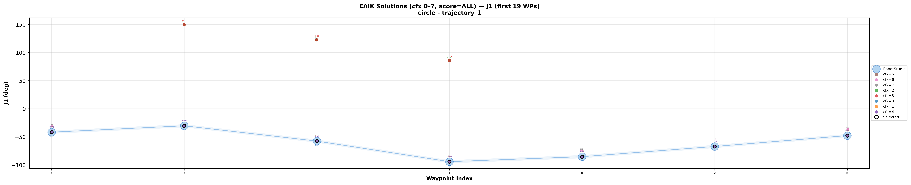
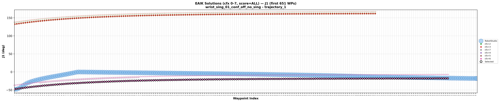
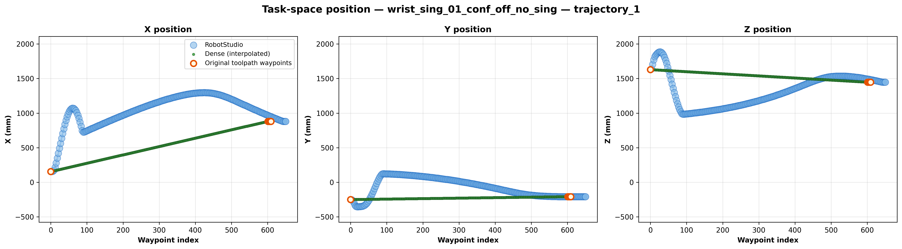
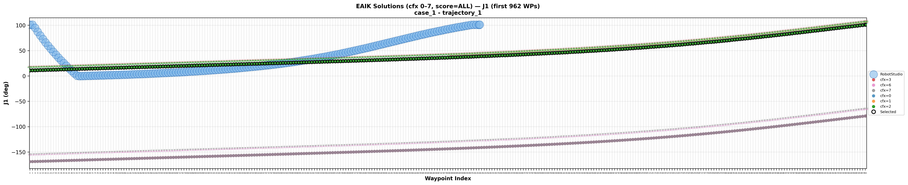
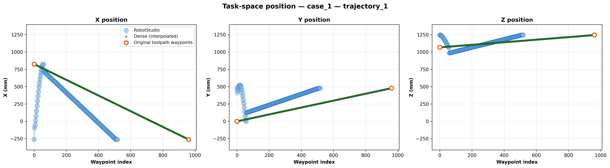

# Feature 2 Validation — Results Summary

---

## Experiment 19 — Continuous Path Branch Tracking

We ran the six toolpaths through our arc-length parameterization and EAIK branch-tracking pipeline. For each toolpath we compared the cfx our solver selected at each waypoint against your recorded cfx, checked C0 continuity across the selected branch, and checked for any wrist-singular points along the path. Only waypoints where `is_at_waypoint = 1` were included.

**Verdict:** cfx matched at every valid waypoint across all six toolpaths. C0 continuity was clean with no joint-space jumps. No wrist singularities were encountered.

*EAIK-selected cfx vs your recorded cfx for joint 1 on the circle toolpath (representative run).*



```
Experiment_19/
└── <toolpath_name>/
    ├── cfx_selection/
    │   ├── eaik_solutions_cfx_j1.png … eaik_solutions_cfx_j6.png
    └── task_space_interpolation_comparision/
```

---

## Experiment 20 — Wrist Singularity Detection on Interpolated Path

We ran all four waypoint pairs through our arc-length interpolation at `max_gap_mm: 1.5`. We compared our interpolated Cartesian trajectory against your recorded TCP path, and scored our selected EAIK branch for C0 continuity and wrist singularity proximity (near J5 = 0). The with-`SingArea \Wrist` runs were used for joint-space comparison since those are the cases that produced a full trajectory.

**Verdict:** task-space interpolation matched your recorded TCP path closely. C0 continuity held through the near-singular region. Our singularity check correctly flagged the J5 ≈ 0 zone at the same arc-length region where J4/J6 spikes appear in your data.

*EAIK vs recorded cfx for joint 1 on `wrist_sing_01_conf_off_no_sing` (interpolated path vs RobotStudio).*



*TCP position vs arc length: our interpolated Cartesian path vs your recorded TCP trajectory (first segment).*



```
Experiment_20/
└── <waypoint_set_name>/
    ├── cfx_selection/
    └── task_space_interpolation_comparision/
```

---

## Experiment 21 — Branch Switch Detection

We compared the cfx our solver selected across all 33 cases against your recorded cfx values. For cases where the robot completed the move we checked that our solver chose the same branch. For cases where a configuration boundary crossing was required and you got a RAPID error, we checked that our solver flagged a `BRANCH_DISCONTINUITY` rather than silently switching branch.

**Verdict:** cfx matched on all successful cases. Every case that required a cross-configuration move and threw a RAPID error on your end was flagged as a branch discontinuity on ours.

*EAIK vs recorded cfx for joint 1 on case 1 (branch-tracking validation).*



*TCP position vs arc length for case 1: interpolated path vs recorded trajectory.*



```
Experiment_21/
└── <case_name>/
    └── cfx_selection/
```
